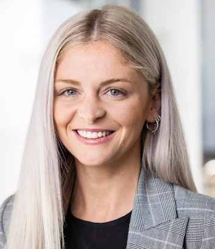

layout: true

<div class="my-footer"><span>UNSW Data Science Hub / <a href='https://www.unsw.edu.au/research/udash'>uDASH</a></span></div>

<!-- this adds the link footer to all slides, depends on my-footer class in css-->

```{r setup, include=FALSE}
options(htmltools.dir.version = FALSE)

library(fontawesome)
```

```{r xaringan-logo, echo=FALSE}
xaringanExtra::use_logo(
  image_url = "images/uDASH-logo.jpg",
  position = xaringanExtra::css_position(top = "1em", right = "1em")
)
```

```{r xaringan-themer, include=FALSE, warning=FALSE}
library(xaringanthemer)
uDASH_colors <- c(blue1="#CEDAD5", blue2="#16938F", blackish="#0E0F0F", green1="#79C45E", green2="#68A170", brownish="#949494", bluish="#769CBE", greenish="#4E722F")
#style_solarized_dark(
style_duo_accent(
  primary_color = uDASH_colors[5], secondary_color = uDASH_colors[1],
#  base_color = "#1c5253",
  header_font_google = google_font("Roboto Slab"),
  text_font_google   = google_font("Roboto", "300", "300i"),
  code_font_google   = google_font("Roboto Mono"),
  code_font_size = '0.7rem'
)
library(fontawesome)
```

---

class: center,inverse
background-image: url("images/Heal-Country-NAIDOC-2021.png")
background-position: center
background-size: contain

---
layout:true

# UNSW Data Science Work Experience Week

---

## Five days as a data scientist!

### When

Monday 21st to Friday 25th of November 2022

### Where

UNSW Kensington Campus


---

### Aim:

Offer students an introduction to the basic principles of data visualisation and statistical modelling

### Students will:

  - Learn to use useful software

  - Get hands-on experience in analysing real data sets

---
layout:true

# uDASH

---

> ***We translate large volumes of data into knowledge to support decision-making.***

### An official UNSW Research Centre

Informally created in Feb 2020, formally established October 2021

### Data experts across UNSW

**100+** data experts – spread across UNSW’s broad and diverse faculties of Science, Engineering, Medicine, Law, Business, Aus Defence Force Academy, and Arts, Design & Architecture – Individuals whose interests and skillsets are broad and diverse.

---

## Aim

Bring together UNSW’s full spectrum of data specialists to solve complex, real-world challenges, faced by business/industry.

---

Our scientists are specialists in:
- Mathematics and Statistics
- Machine Learning and AI
- Data visualisation
- Computational modelling and simulation
- Non-linear dynamics and optimisation
- Data privacy
- Probabilistic modelling
- Risk quantification and management
- Business, economics, and marketing
- Spatial modelling
- Big and complex data
- Genomics and medical data
- Ecological, environmental and climate data
- Defence research

---
layout: false

class: center,inverse

# What is our plan for the work experience?

---
layout: true

## Five days as a data scientist!

---

### Monday:

- general introduction,
- software installation + first steps,
- case studies,
- group selection

--

### Tuesday — Thursday:

- examples in the morning,
- work on case studies in the afternoon

--

### Friday:

- Final preparation and presentations

---

## Mornings:

Program of lectures with example of applications of Data Science

Practical: code, visualise and discuss

--

## Afternoons:

Groups of 4 or 5 students will select one case study

Goal: Visualise patterns, postulate hypothesis, apply statistical tests and discuss

Helpers will give advice and recommendations

---
layout: false

# uDASH team

<table>
<tr>
  <td align='center'></td>
  <td align='center'></td>
<td align='center'></td>
</tr>

<tr>
  <th>Scott Sisson</th>
  <th>Katie West</th>
  <th>José R. Ferrer</th>
</tr>

<tr>
<td align='center'></td>
<td align='center'></td>
<td align='center'>   </td>
</tr>

<tr>
<th>Boris Beranger</th>
<th>Ryan Thompson</th>
<th>Anikó B. Tóth</th>
</tr>

<tr>
<th>Steefan Contractor</th>
  <th>Elma Akand</th>
  <th>Ziyang Lyu</th>
  </tr>
  <tr>
  <th></th>
  <th>Amy Li</th>
  <th></th>
  </tr>

  <tr>
  <th><b>uDASH postdocs</b></th>
  <th><b>DataSoc</b></th>
  <th><b>UNSW SciX</b></th>
  </tr>
  <tr>
  <td align='center'><font size='3px'>Joshua Connor <br/> Maeve McGillycuddy</font></td>
  <td align='center'><font size='3px'>Fiza Shafeeque <br/> Srikar Danthurty</font></td>
  <td align='center'><font size='3px'>Isabelle Greco <br/> Rachael Isphording</font></td>
</tr>
</table>

---


# Thanks!


[`r fa(name = "twitter")` @uDASH_UNSW](https://twitter.com/uDASH_UNSW)

[`r fa(name = "house")` //www.unsw.edu.au/research/udash](https://www.unsw.edu.au/research/udash)

[`r fa(name = "paper-plane")` uDASH@unsw.edu.au](mailto:uDASH@unsw.edu.au )
